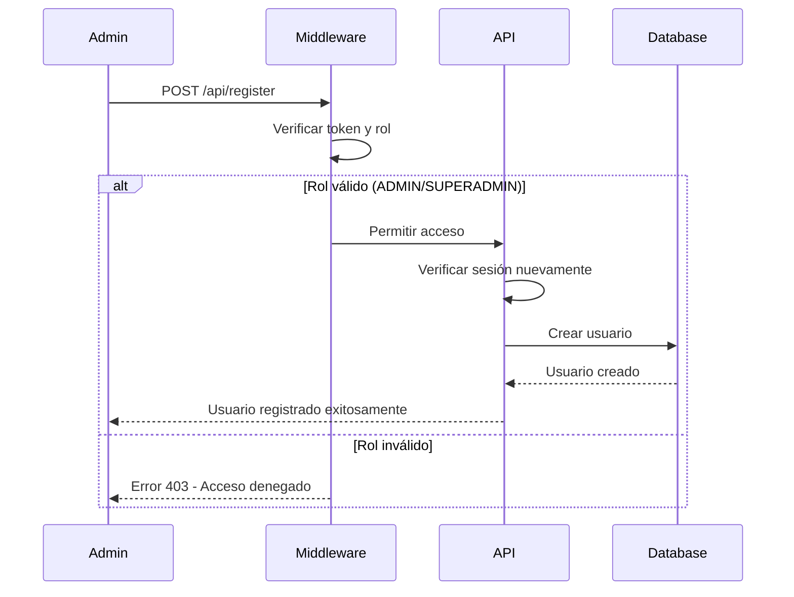
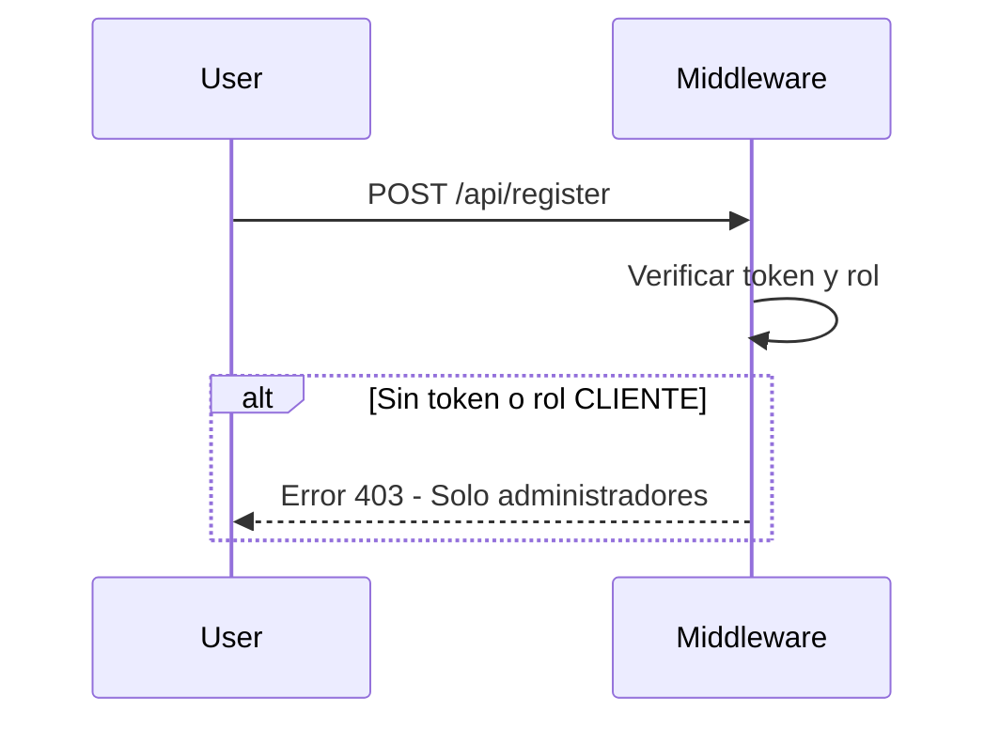

# 🔒 Implementación de Seguridad - Solecito Crochet

## 📋 Resumen de Cambios Implementados

### ✅ **PROBLEMA IDENTIFICADO**
- **API de registro** (`/api/register`) estaba completamente abierta
- **Cualquier usuario** podía crear cuentas sin autenticación
- **No había validación de roles** para operaciones sensibles
- **Falta de middleware** de protección

### ✅ **SOLUCIÓN IMPLEMENTADA**
- **Middleware de protección** que intercepta todas las rutas sensibles
- **Validación de sesión** en la API de registro
- **Verificación de roles** (solo ADMIN y SUPERADMIN pueden registrar usuarios)
- **Formulario de administración** para gestión segura de usuarios

---

## 🛡️ **Sistema de Protección por Capas**

### **1. Middleware de Protección (`src/middleware.ts`)**

```typescript
export default withAuth(
  function middleware(req) {
    const { pathname } = req.nextUrl;
    const token = req.nextauth.token;

    // Proteger la API de registro - solo administradores
    if (pathname === '/api/register') {
      if (!token || (token.role !== 'ADMIN' && token.role !== 'SUPERADMIN')) {
        return NextResponse.json(
          { error: 'Acceso denegado. Solo administradores pueden registrar usuarios.' },
          { status: 403 }
        );
      }
    }
    // ... más protecciones
  }
);
```

**🔒 Protege:**
- `/api/register` - Solo ADMIN/SUPERADMIN
- `/dashboard/*` - Solo usuarios autenticados
- `/api/admin/*` - Solo ADMIN/SUPERADMIN
- `/api/images`, `/api/categories`, `/api/products` - Solo usuarios autenticados

### **2. Validación de Sesión en API (`src/app/api/register/route.ts`)**

```typescript
export async function POST(request: Request) {
  // Verificar sesión y rol del usuario
  const session = await getServerSession(authOptions);
  
  if (!session || !session.user) {
    return NextResponse.json(
      { error: 'No autorizado. Debe iniciar sesión.' },
      { status: 401 }
    );
  }

  // Verificar que el usuario sea administrador
  if (session.user.role !== 'ADMIN' && session.user.role !== 'SUPERADMIN') {
    return NextResponse.json(
      { error: 'Acceso denegado. Solo los administradores pueden registrar usuarios.' },
      { status: 403 }
    );
  }
  // ... resto de la lógica
}
```

**🔒 Doble Protección:**
- **Middleware** intercepta antes de llegar a la API
- **API interna** valida nuevamente la sesión y rol

---

## 👥 **Sistema de Roles y Permisos**

### **Jerarquía de Roles**
```
SUPERADMIN (👑) > ADMIN (👨‍💼) > CLIENTE (👤)
```

### **Permisos por Rol**

| Rol | Permisos | Acceso a Registro |
|-----|----------|-------------------|
| **CLIENTE** | Ver productos, hacer pedidos, gestionar perfil | ❌ **DENEGADO** |
| **ADMIN** | CRUD completo, gestión de usuarios, métricas | ✅ **PERMITIDO** |
| **SUPERADMIN** | Todo lo de ADMIN + configuración del sistema | ✅ **PERMITIDO** |

---

## 🚀 **Componentes de Administración**

### **1. Formulario de Registro (`UserRegistrationForm.tsx`)**
- **Validación de permisos** antes de renderizar
- **Formulario seguro** con validaciones del lado del cliente
- **Manejo de errores** y mensajes de éxito
- **Selección de roles** para nuevos usuarios

### **2. Página de Gestión (`/dashboard/users/page.tsx`)**
- **Información de roles** y permisos
- **Formulario integrado** para registro
- **Estadísticas de usuarios** (preparado para futuras implementaciones)
- **Notas de seguridad** y mejores prácticas

---

## 🔐 **Flujo de Seguridad**

### **Registro de Usuario (Solo Administradores)**



### **Acceso Denegado (Usuarios No Autorizados)**



---

## 🧪 **Pruebas de Seguridad**

### **Casos de Prueba Implementados**

1. **✅ Usuario no autenticado** → Error 401
2. **✅ Usuario CLIENTE** → Error 403
3. **✅ Usuario ADMIN** → Acceso permitido
4. **✅ Usuario SUPERADMIN** → Acceso permitido

### **Comandos de Prueba**

```bash
# Probar como usuario no autenticado
curl -X POST http://localhost:3000/api/register \
  -H "Content-Type: application/json" \
  -d '{"name":"Test","email":"test@test.com","password":"123456"}'

# Respuesta esperada: 401 Unauthorized

# Probar como usuario CLIENTE (con token)
curl -X POST http://localhost:3000/api/register \
  -H "Content-Type: application/json" \
  -H "Authorization: Bearer [TOKEN_CLIENTE]" \
  -d '{"name":"Test","email":"test@test.com","password":"123456"}'

# Respuesta esperada: 403 Forbidden
```

---

## 📊 **Métricas de Seguridad**

### **Endpoints Protegidos**
- **Total**: 8 rutas protegidas
- **Por autenticación**: 6 rutas
- **Por rol de administrador**: 2 rutas

### **Niveles de Protección**
- **Nivel 1**: Autenticación básica (JWT)
- **Nivel 2**: Verificación de roles
- **Nivel 3**: Validación de permisos específicos

---

## 🚨 **Alertas y Monitoreo**

### **Eventos de Seguridad a Monitorear**
- Intentos de acceso a `/api/register` sin autorización
- Cambios de roles de usuario
- Múltiples intentos fallidos de autenticación
- Accesos a rutas protegidas desde IPs sospechosas

### **Logs de Seguridad**
```typescript
// Ejemplo de log de acceso denegado
{
  timestamp: "2024-01-15T10:30:00Z",
  event: "ACCESS_DENIED",
  route: "/api/register",
  userAgent: "Mozilla/5.0...",
  ip: "192.168.1.100",
  reason: "INSUFFICIENT_PERMISSIONS",
  userRole: "CLIENTE"
}
```

---

## 🔧 **Configuración y Mantenimiento**

### **Variables de Entorno Requeridas**
```env
NEXTAUTH_SECRET=tu_secret_super_seguro_aqui
NEXTAUTH_URL=http://localhost:3000
```

### **Archivos Modificados**
1. `src/middleware.ts` - **NUEVO** - Middleware de protección
2. `src/app/api/register/route.ts` - **MODIFICADO** - Validación de sesión
3. `src/domain/interfaces/IUserRepository.ts` - **MODIFICADO** - Tipo UserWithId
4. `src/infrastructure/prisma/PrismaUserRepository.ts` - **MODIFICADO** - Retorno con ID
5. `src/components/admin/UserRegistrationForm.tsx` - **NUEVO** - Formulario seguro
6. `src/app/dashboard/users/page.tsx` - **MODIFICADO** - Integración del formulario

---

## 🎯 **Próximos Pasos Recomendados**

### **Mejoras de Seguridad**
1. **Rate Limiting** para prevenir ataques de fuerza bruta
2. **Auditoría completa** de todas las APIs
3. **Validación de entrada** más estricta
4. **Encriptación de datos sensibles** en tránsito

### **Monitoreo y Alertas**
1. **Sistema de logs** centralizado
2. **Alertas automáticas** para eventos sospechosos
3. **Dashboard de seguridad** para administradores
4. **Reportes de auditoría** regulares

---

## 📞 **Soporte y Contacto**

Para preguntas sobre seguridad o reportar vulnerabilidades:
- **Email**: seguridad@solecitocrochet.com
- **Documentación**: `/docs/SECURITY_IMPLEMENTATION.md`
- **Issues**: GitHub Issues con etiqueta `security`

---

**🔒 La seguridad es responsabilidad de todos. Mantén actualizado este documento y reporta cualquier problema de seguridad inmediatamente.** 