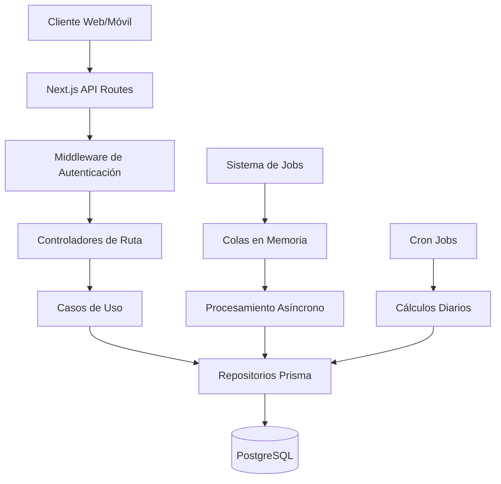
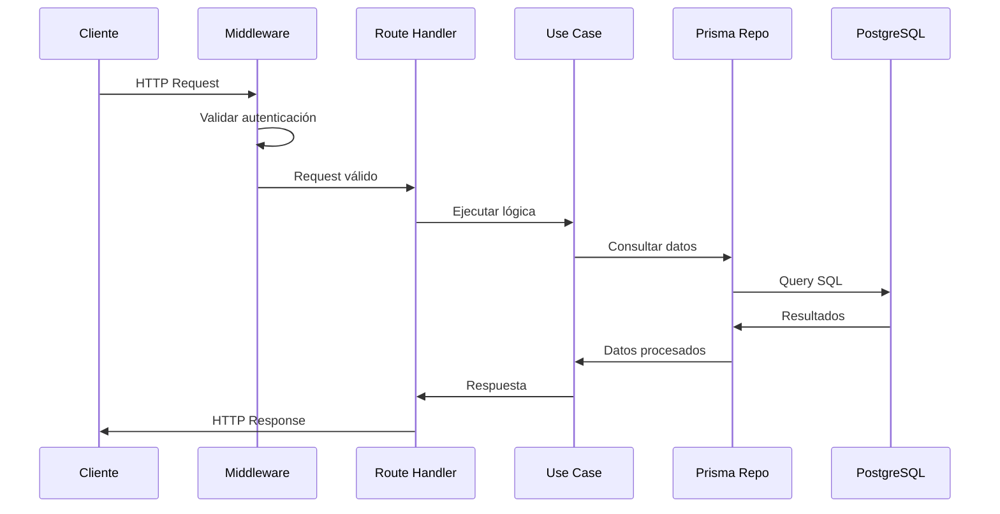

# ??? Arquitectura del Sistema - API Solecito Crochet

## ?? Visión General

La API de Solecito Crochet está construida siguiendo una arquitectura moderna y escalable, utilizando Next.js 15 con el patrón App Router, Prisma ORM para la gestión de base de datos, y un sistema de jobs asíncrono para procesamiento en segundo plano.

## ??? Arquitectura General



## ?? Estructura del Proyecto

```
src/
+-- app/                    # Next.js App Router
¦   +-- api/               # API Routes
¦   ¦   +-- auth/         # Autenticación
¦   ¦   +-- products/     # Productos
¦   ¦   +-- categories/   # Categorías
¦   ¦   +-- images/       # Imágenes
¦   ¦   +-- admin/        # Administración
¦   +-- dashboard/        # Panel administrativo
¦   +-- login/           # Páginas de login
+-- components/           # Componentes React
+-- lib/                 # Utilidades y configuración
¦   +-- auth.ts          # Configuración NextAuth
¦   +-- popularity.ts    # Sistema de popularidad
¦   +-- simpleJobScheduler.ts # Jobs asíncronos
+-- domain/              # Lógica de dominio
¦   +-- entities/        # Entidades del negocio
¦   +-- utils/           # Utilidades de dominio
+-- infrastructure/      # Capa de infraestructura
¦   +-- prisma/          # Repositorios Prisma
+-- types/               # Definiciones TypeScript
```

## ?? Tecnologías Principales

### Framework y Runtime
- **Next.js 15**: Framework React full-stack con App Router
- **React 19**: Librería de UI con Server Components
- **TypeScript 5**: Tipado estático para mayor robustez

### Base de Datos
- **PostgreSQL 15+**: Base de datos relacional robusta
- **Prisma 6.10**: ORM moderno con migraciones automáticas

### Autenticación y Seguridad
- **NextAuth.js 4.24**: Autenticación completa con JWT
- **bcryptjs**: Encriptación de contraseñas
- **Roles**: CLIENTE, ADMIN, SUPERADMIN

### Procesamiento Asíncrono
- **node-cron**: Jobs programados
- **Colas en memoria**: Procesamiento de jobs sin Redis
- **Sistema de métricas**: Cálculos automáticos de popularidad

## ??? Modelo de Datos

### Entidades Principales

#### Usuario (User)
```typescript
{
  id: string
  name?: string
  email: string (único)
  password: string (encriptada)
  role: UserRole (CLIENTE | ADMIN | SUPERADMIN)
  accounts: Account[]
  sessions: Session[]
  products: Product[]
}
```

#### Producto (Product)
```typescript
{
  id: string
  name: string
  description?: string
  price: number
  category: string
  categoryId?: string
  stock: number
  isActive: boolean
  featured: boolean
  materials?: string
  dimensions?: string
  weight?: string
  careInstructions?: string
  images: ProductImage[]
  creator: User
  popularity: PopularityMetric
}
```

#### Categoría (Category)
```typescript
{
  id: string
  name: string (único)
  slug: string (único)
  icon: string
  description?: string
  isActive: boolean
  isCustom: boolean
  products: Product[]
}
```

## ?? Sistema de Popularidad

### Algoritmos de Scoring

#### Popularidad General
```typescript
popularityScore = 
  (weeklyClicks × 0.4) + 
  (monthlyClicks × 0.3) + 
  (whatsappClicks × 2.0) + 
  (favoriteClicks × 1.5) + 
  (totalClicks × 0.1)
```

#### Productos Destacados
```typescript
featuredScore = 
  (whatsappClicks × 3.0) + 
  (favoriteClicks × 1.0) + 
  (weeklyClicks × 0.5) + 
  (monthlyClicks × 0.3)
```

### Clasificación Automática
- **Top 20%** ? Productos Populares
- **Top 15%** ? Productos Destacados
- **Reset periódico**: Semanal, mensual, anual

## ?? Sistema de Jobs Asíncronos

### Tipos de Jobs
1. **Popularity**: Cálculo de métricas de popularidad
2. **Featured**: Evaluación para productos destacados
3. **Classification**: Clasificación automática

### Programación
- **Diaria**: 6:00 AM (hora Nicaragua)
- **Manual**: Desde panel administrativo
- **Por producto**: Triggers automáticos

## ?? Seguridad

### Autenticación
- JWT con NextAuth.js
- Sesiones seguras
- Protección CSRF

### Autorización
- Middleware de validación de roles
- Verificación en cada endpoint protegido
- Logs de acceso

### Validación
- Validación de entrada en controladores
- Sanitización de datos
- Límites de rate limiting

## ?? Rendimiento

### Optimizaciones
- **Paginación**: skip/take eficiente
- **Cache**: Headers HTTP apropiados
- **Queries**: Optimizadas con select
- **Imágenes**: Compresión automática

### Métricas de Performance
- Tiempo de respuesta < 200ms
- Throughput de 1000+ req/min
- Cache hit rate > 80%

## ?? Escalabilidad

### Estrategias
- **Horizontal**: Múltiples instancias
- **Vertical**: Optimización de recursos
- **Cache**: Redis para sesiones
- **CDN**: Para imágenes estáticas

### Límites Actuales
- **Jobs**: Procesamiento en memoria
- **Imágenes**: Almacenamiento en DB
- **Sesiones**: Sin Redis clustering

## ?? Ciclo de Vida de una Solicitud



## ?? Testing

### Estrategias
- **Unit Tests**: Funciones utilitarias
- **Integration Tests**: API endpoints
- **E2E Tests**: Flujos completos

### Herramientas
- **Jest**: Framework de testing
- **Supertest**: Testing de API
- **Prisma Test**: Base de datos de test

## ?? Checklist de Arquitectura

### ? Principios Seguidos
- [x] Separación de responsabilidades
- [x] Inyección de dependencias
- [x] Principio de responsabilidad única
- [x] Abierto/cerrado principle

### ? Patrones Implementados
- [x] Repository Pattern
- [x] Strategy Pattern (jobs)
- [x] Observer Pattern (cron jobs)
- [x] Factory Pattern (productos)

### ? Mejores Prácticas
- [x] Error handling consistente
- [x] Logging estructurado
- [x] Validación de entrada
- [x] Documentación completa

---

## ?? Conclusiones

Esta arquitectura proporciona:

1. **Escalabilidad**: Fácil de escalar horizontalmente
2. **Mantenibilidad**: Código organizado y documentado
3. **Performance**: Optimizaciones en todos los niveles
4. **Seguridad**: Múltiples capas de protección
5. **Flexibilidad**: Fácil agregar nuevas funcionalidades

La arquitectura está preparada para crecer con el negocio y adaptarse a nuevos requisitos sin comprometer la estabilidad del sistema existente.
