# 🏗️ Arquitectura del Sistema - Solecito Crochet

## 📋 Descripción General

Esta documentación describe la arquitectura completa del sistema Solecito Crochet, incluyendo la estructura del proyecto, patrones de diseño, tecnologías utilizadas y estrategias de implementación.

---

## 🎯 Visión de Arquitectura

### Principios de Diseño

- **Clean Architecture**: Separación clara de responsabilidades
- **Domain-Driven Design**: Lógica de negocio centrada en el dominio
- **SOLID Principles**: Principios de diseño de software robusto
- **Microservices Ready**: Preparado para escalabilidad horizontal
- **Performance First**: Optimización desde el diseño inicial

---

## 🏛️ Arquitectura General

### Diagrama de Alto Nivel

```mermaid
graph TB
    subgraph "Frontend Layer"
        Web[Web App - Next.js]
        Mobile[Mobile App - React Native]
        Admin[Admin Dashboard]
    end
    
    subgraph "API Gateway"
        NextJS[Next.js App Router]
        Auth[NextAuth.js]
        Middleware[Middleware & Guards]
    end
    
    subgraph "Business Logic Layer"
        UseCases[Use Cases]
        Services[Domain Services]
        Validators[Validators]
    end
    
    subgraph "Data Layer"
        Prisma[Prisma ORM]
        PostgreSQL[(PostgreSQL)]
        Cache[Cache Layer]
    end
    
    subgraph "External Services"
        Email[Email Service]
        Storage[File Storage]
        Analytics[Analytics]
    end
    
    Web --> NextJS
    Mobile --> NextJS
    Admin --> NextJS
    NextJS --> Auth
    NextJS --> Business Logic Layer
    Business Logic Layer --> Data Layer
    Data Layer --> External Services
```

### Capas de la Arquitectura

#### 1. Presentation Layer
- **Next.js App Router**: Páginas y componentes
- **API Routes**: Endpoints de la API
- **Middleware**: Autenticación y autorización
- **Components**: UI reutilizables

#### 2. Application Layer
- **Use Cases**: Casos de uso de la aplicación
- **DTOs**: Objetos de transferencia de datos
- **Validators**: Validación de entrada
- **Orchestrators**: Coordinación de servicios

#### 3. Domain Layer
- **Entities**: Entidades del dominio
- **Interfaces**: Contratos y abstracciones
- **Domain Services**: Lógica de negocio
- **Value Objects**: Objetos de valor

#### 4. Infrastructure Layer
- **Prisma**: ORM y acceso a datos
- **External APIs**: Servicios externos
- **File Storage**: Almacenamiento de archivos
- **Caching**: Sistema de cache

---

## 🗂️ Estructura del Proyecto

### Organización de Directorios

```
src/
├── app/                    # App Router de Next.js 15
│   ├── api/               # Endpoints de la API
│   │   ├── auth/          # Autenticación
│   │   ├── products/      # Gestión de productos
│   │   ├── categories/    # Sistema de categorías
│   │   ├── images/        # Gestión de imágenes
│   │   └── admin/         # Panel administrativo
│   ├── dashboard/         # Panel administrativo
│   └── products/          # Páginas de productos
├── components/            # Componentes reutilizables
│   ├── admin/            # Componentes administrativos
│   ├── auth/             # Componentes de autenticación
│   ├── products/         # Componentes de productos
│   └── ui/               # Componentes de UI genéricos
├── domain/               # Lógica de negocio
│   ├── entities/         # Entidades del dominio
│   ├── interfaces/       # Contratos/interfaces
│   └── utils/            # Utilidades del dominio
├── application/          # Casos de uso
│   ├── dtos/            # Objetos de transferencia de datos
│   └── usecases/        # Casos de uso de la aplicación
├── infrastructure/       # Implementaciones técnicas
│   └── prisma/          # Implementación de Prisma
├── hooks/               # Hooks personalizados de React
├── lib/                 # Utilidades y configuración
├── providers/           # Proveedores de contexto
├── services/            # Servicios de la aplicación
├── types/               # Tipos de TypeScript
└── utils/               # Utilidades generales
```

### Patrones Arquitectónicos

#### Clean Architecture
```
┌─────────────────────────────────────┐
│           Presentation Layer        │ ← API Routes, Components
├─────────────────────────────────────┤
│           Application Layer         │ ← Use Cases, DTOs
├─────────────────────────────────────┤
│             Domain Layer            │ ← Entities, Interfaces
├─────────────────────────────────────┤
│         Infrastructure Layer        │ ← Prisma, External APIs
└─────────────────────────────────────┘
```

#### Repository Pattern
```typescript
// Interface del repositorio
interface IUserRepository {
  create(user: User): Promise<User>;
  findByEmail(email: string): Promise<User | null>;
  findById(id: string): Promise<User | null>;
  update(id: string, data: Partial<User>): Promise<User>;
  delete(id: string): Promise<void>;
}

// Implementación con Prisma
export class PrismaUserRepository implements IUserRepository {
  async create(user: User): Promise<User> {
    return await prisma.user.create({
      data: {
        name: user.name,
        email: user.email,
        password: user.password,
        role: user.role as UserRole
      }
    });
  }
  
  // ... otros métodos
}
```

#### Use Case Pattern
```typescript
export class RegisterUser {
  constructor(private userRepo: IUserRepository) {}

  async execute(data: RegisterUserDTO): Promise<User> {
    // Validaciones de negocio
    if (!data.email || !data.password) {
      throw new Error("Email y password son requeridos");
    }
    
    // Lógica de negocio
    const existingUser = await this.userRepo.findByEmail(data.email);
    if (existingUser) {
      throw new Error("El usuario ya existe");
    }
    
    // Creación del usuario
    const hashedPassword = await hashPassword(data.password);
    const user = new User(data.name, data.email, hashedPassword, data.role);
    
    return await this.userRepo.create(user);
  }
}
```

---

## 🔐 Sistema de Autenticación

### Arquitectura de NextAuth.js

```mermaid
sequenceDiagram
    participant Client
    participant NextAuth
    participant Prisma
    participant Database
    
    Client->>NextAuth: POST /api/auth/signin
    NextAuth->>Prisma: Buscar usuario por email
    Prisma->>Database: Query SELECT
    Database-->>Prisma: Usuario encontrado
    Prisma-->>NextAuth: Datos del usuario
    NextAuth->>NextAuth: Verificar contraseña
    NextAuth->>NextAuth: Generar JWT token
    NextAuth-->>Client: Token de sesión
```



### Middleware de Protección

```typescript
// middleware.ts
import { withAuth } from 'next-auth/middleware';

export default withAuth(
  function middleware(req) {
    // Lógica adicional del middleware
  },
  {
    callbacks: {
      authorized: ({ token, req }) => {
        // Verificar permisos específicos
        if (req.nextUrl.pathname.startsWith('/admin')) {
          return token?.role === 'ADMIN' || token?.role === 'SUPERADMIN';
        }
        return !!token;
      },
    },
  }
);

export const config = {
  matcher: ['/dashboard/:path*', '/admin/:path*']
};
```

---

## 📊 Sistema de Popularidad

### Arquitectura del Algoritmo


### Implementación del Job Scheduler

```typescript
export class SimpleJobScheduler {
  private jobs: Map<string, Job> = new Map();
  private isRunning = false;

  addJob(name: string, job: Job): void {
    this.jobs.set(name, job);
  }

  async start(): Promise<void> {
    if (this.isRunning) return;
    
    this.isRunning = true;
    
    while (this.isRunning) {
      for (const [name, job] of this.jobs) {
        if (job.shouldRun()) {
          try {
            await job.execute();
            job.updateLastRun();
          } catch (error) {
            console.error(`Error ejecutando job ${name}:`, error);
          }
        }
      }
      
      // Esperar antes de la siguiente iteración
      await new Promise(resolve => setTimeout(resolve, 60000)); // 1 minuto
    }
  }

  stop(): void {
    this.isRunning = false;
  }
}
```

---

## 🖼️ Gestión de Imágenes

### Arquitectura de BLOB Storage


### Implementación de Optimización

```typescript
export class ImageOptimizer {
  async optimizeImage(buffer: Buffer, options: OptimizationOptions): Promise<Buffer> {
    // Redimensionar imagen
    const resized = await this.resize(buffer, options.width, options.height);
    
    // Comprimir imagen
    const compressed = await this.compress(resized, options.quality);
    
    // Convertir formato si es necesario
    if (options.format) {
      return await this.convertFormat(compressed, options.format);
    }
    
    return compressed;
  }

  private async resize(buffer: Buffer, width: number, height: number): Promise<Buffer> {
    // Implementación de redimensionamiento
  }

  private async compress(buffer: Buffer, quality: number): Promise<Buffer> {
    // Implementación de compresión
  }
}
```

---

## 🗄️ Modelo de Datos

### Esquema de Base de Datos

```mermaid
erDiagram
    User {
        string id PK
        string name
        string email UK
        string password
        enum role
        datetime createdAt
        datetime updatedAt
    }
    
    Product {
        string id PK
        string name
        text description
        float price
        string category
        string categoryId FK
        int stock
        boolean isActive
        boolean featured
        string materials
        string dimensions
        string weight
        string careInstructions
        string createdBy FK
        datetime createdAt
        datetime updatedAt
    }
    
    Category {
        string id PK
        string name UK
        string slug UK
        string icon
        text description
        boolean isActive
        boolean isCustom
        datetime createdAt
        datetime updatedAt
    }
    
    ProductImage {
        string id PK
        string productId FK
        string url
        string altText
        boolean isMain
        int order
        bytes imageData
        string mimeType
        string filename
        int fileSize
        datetime createdAt
        datetime updatedAt
    }
    
    ProductClick {
        string id PK
        string productId FK
        string userAgent
        string ipAddress
        string referrer
        string clickType
        int year
        int month
        int week
        int day
        int hour
        datetime createdAt
    }
    
    PopularityMetric {
        string id PK
        string productId FK UK
        int totalClicks
        int weeklyClicks
        int monthlyClicks
        int yearlyClicks
        int viewClicks
        int whatsappClicks
        int favoriteClicks
        float popularityScore
        float featuredScore
        boolean isFeatured
        boolean isPopular
        datetime lastCalculated
        datetime updatedAt
    }
    
    User ||--o{ Product : creates
    Product ||--o{ ProductImage : has
    Product ||--o{ ProductClick : tracks
    Product ||--o| PopularityMetric : has
    Category ||--o{ Product : categorizes
```

### Relaciones y Restricciones

#### Relaciones Principales
- **User → Product**: Un usuario puede crear múltiples productos (1:N)
- **Product → Category**: Un producto pertenece a una categoría (N:1)
- **Product → ProductImage**: Un producto puede tener múltiples imágenes (1:N)
- **Product → ProductClick**: Un producto puede tener múltiples clicks (1:N)
- **Product → PopularityMetric**: Un producto tiene una métrica de popularidad (1:1)

#### Restricciones de Integridad
- **Foreign Keys**: Todas las relaciones están protegidas con FK
- **Unique Constraints**: Email de usuario, slug de categoría
- **Cascade Deletes**: Eliminación en cascada para imágenes y clicks
- **Soft Deletes**: Productos se marcan como inactivos en lugar de eliminar

---

## 🔄 Flujos de Datos

### Flujo de Creación de Producto

```mermaid
sequenceDiagram
    participant Admin
    participant API
    participant Validator
    participant UseCase
    participant Repository
    participant Database
    
    Admin->>API: POST /api/products
    API->>Validator: Validar datos de entrada
    Validator-->>API: Datos válidos
    API->>UseCase: Crear producto
    UseCase->>Repository: Guardar en BD
    Repository->>Database: INSERT
    Database-->>Repository: Producto creado
    Repository-->>UseCase: Producto
    UseCase-->>API: Respuesta
    API-->>Admin: Producto creado
```



### Flujo de Tracking de Popularidad

```mermaid
sequenceDiagram
    participant User
    participant Frontend
    participant API
    participant Tracker
    participant Database
    
    User->>Frontend: Click en producto
    Frontend->>API: POST /api/products/[id]/track
    API->>Tracker: Registrar interacción
    Tracker->>Database: INSERT click
    Tracker->>Database: UPDATE métricas
    Database-->>Tracker: Confirmación
    Tracker-->>API: Interacción registrada
    API-->>Frontend: Respuesta
    Frontend-->>User: Feedback visual
```



---

## 🚀 Estrategias de Escalabilidad

### Escalabilidad Horizontal

#### Load Balancing
```typescript
// Configuración para múltiples instancias
export const serverConfig = {
  port: process.env.PORT || 3000,
  hostname: '0.0.0.0',
  maxConnections: 1000,
  keepAlive: true,
  keepAliveTimeout: 5000
};
```

#### Database Sharding
```typescript
// Estrategia de sharding por categoría
export class ShardedProductRepository {
  private getShard(category: string): string {
    const shards = ['shard1', 'shard2', 'shard3'];
    const hash = this.hashString(category);
    return shards[hash % shards.length];
  }

  private hashString(str: string): number {
    let hash = 0;
    for (let i = 0; i < str.length; i++) {
      const char = str.charCodeAt(i);
      hash = ((hash << 5) - hash) + char;
      hash = hash & hash; // Convert to 32bit integer
    }
    return Math.abs(hash);
  }
}
```

### Escalabilidad Vertical

#### Connection Pooling
```typescript
// Configuración de pool de conexiones
export const databaseConfig = {
  pool: {
    min: 2,
    max: 20,
    acquireTimeoutMillis: 30000,
    createTimeoutMillis: 30000,
    destroyTimeoutMillis: 5000,
    idleTimeoutMillis: 30000,
    reapIntervalMillis: 1000,
    createRetryIntervalMillis: 200
  }
};
```

#### Caching Strategy
```typescript
// Sistema de cache en múltiples niveles
export class CacheManager {
  private memoryCache = new Map<string, any>();
  private redisCache: Redis;

  async get(key: string): Promise<any> {
    // 1. Check memory cache
    if (this.memoryCache.has(key)) {
      return this.memoryCache.get(key);
    }

    // 2. Check Redis cache
    const redisValue = await this.redisCache.get(key);
    if (redisValue) {
      this.memoryCache.set(key, redisValue);
      return redisValue;
    }

    // 3. Fetch from database
    return null;
  }

  async set(key: string, value: any, ttl: number = 3600): Promise<void> {
    this.memoryCache.set(key, value);
    await this.redisCache.setex(key, ttl, JSON.stringify(value));
  }
}
```

---

## 🔒 Seguridad y Compliance

### Estrategias de Seguridad

#### Autenticación Multi-Factor
```typescript
export class SecurityManager {
  async validateRequest(req: Request): Promise<SecurityResult> {
    // 1. Verificar JWT token
    const token = this.extractToken(req);
    if (!token) {
      return { valid: false, reason: 'No token provided' };
    }

    // 2. Verificar expiración
    if (this.isTokenExpired(token)) {
      return { valid: false, reason: 'Token expired' };
    }

    // 3. Verificar permisos
    const permissions = this.extractPermissions(token);
    if (!this.hasRequiredPermissions(permissions, req.path)) {
      return { valid: false, reason: 'Insufficient permissions' };
    }

    return { valid: true, permissions };
  }
}
```

#### Rate Limiting
```typescript
export class RateLimiter {
  private requests = new Map<string, RequestCount[]>();

  async checkLimit(identifier: string, limit: number, window: number): Promise<boolean> {
    const now = Date.now();
    const userRequests = this.requests.get(identifier) || [];
    
    // Limpiar requests antiguos
    const validRequests = userRequests.filter(
      req => now - req.timestamp < window
    );
    
    if (validRequests.length >= limit) {
      return false;
    }
    
    // Agregar nuevo request
    validRequests.push({ timestamp: now });
    this.requests.set(identifier, validRequests);
    
    return true;
  }
}
```

### Compliance y Auditoría

#### Logging de Auditoría
```typescript
export class AuditLogger {
  async logAction(action: AuditAction): Promise<void> {
    const auditLog = {
      id: generateUUID(),
      userId: action.userId,
      action: action.type,
      resource: action.resource,
      details: action.details,
      ipAddress: action.ipAddress,
      userAgent: action.userAgent,
      timestamp: new Date(),
      metadata: action.metadata
    };

    await this.auditRepository.create(auditLog);
  }
}
```

---

## 📊 Monitoreo y Observabilidad

### Métricas de Performance

#### Health Checks
```typescript
export class HealthChecker {
  async checkHealth(): Promise<HealthStatus> {
    const checks = await Promise.all([
      this.checkDatabase(),
      this.checkRedis(),
      this.checkExternalServices()
    ]);

    const allHealthy = checks.every(check => check.healthy);
    
    return {
      status: allHealthy ? 'healthy' : 'unhealthy',
      timestamp: new Date(),
      checks,
      uptime: process.uptime(),
      memory: process.memoryUsage(),
      cpu: process.cpuUsage()
    };
  }
}
```

#### Performance Monitoring
```typescript
export class PerformanceMonitor {
  private metrics = new Map<string, Metric[]>();

  recordMetric(name: string, value: number, tags: Record<string, string> = {}): void {
    const metric: Metric = {
      name,
      value,
      tags,
      timestamp: Date.now()
    };

    if (!this.metrics.has(name)) {
      this.metrics.set(name, []);
    }

    this.metrics.get(name)!.push(metric);
  }

  getMetrics(name: string, timeRange: TimeRange): Metric[] {
    const metrics = this.metrics.get(name) || [];
    const startTime = Date.now() - timeRange;
    
    return metrics.filter(m => m.timestamp >= startTime);
  }
}
```

---

## 🎯 Roadmap de Arquitectura

### Mejoras Planificadas

#### Corto Plazo (3-6 meses)
- [ ] **API GraphQL**: Implementar GraphQL para consultas complejas
- [ ] **Webhooks**: Sistema de notificaciones en tiempo real
- [ ] **Rate Limiting**: Implementar límites de velocidad por usuario
- [ ] **Caching Redis**: Migrar a Redis para mejor performance

#### Mediano Plazo (6-12 meses)
- [ ] **Microservicios**: Separar en servicios independientes
- [ ] **Event Sourcing**: Sistema de auditoría completo
- [ ] **CQRS**: Separación de lecturas y escrituras
- [ ] **Message Queue**: Sistema de colas para jobs pesados

#### Largo Plazo (12+ meses)
- [ ] **Kubernetes**: Orquestación de contenedores
- [ ] **Service Mesh**: Comunicación entre servicios
- [ ] **Multi-tenancy**: Soporte para múltiples tiendas
- [ ] **Machine Learning**: Recomendaciones inteligentes

---

## 📚 Recursos Adicionales

### Documentación Relacionada
- [README Principal](../README.md) - Visión general del proyecto
- [Guía del Desarrollador](../DEVELOPER_GUIDE.md) - Guía técnica completa
- [Referencia de la API](../API_REFERENCE.md) - Documentación de endpoints

### Herramientas y Tecnologías
- **Next.js 15**: Framework de React con App Router
- **Prisma**: ORM moderno para TypeScript
- **PostgreSQL**: Base de datos relacional robusta
- **NextAuth.js**: Sistema de autenticación completo

---

## 🎉 Conclusión

La arquitectura de Solecito Crochet está diseñada para ser robusta, escalable y mantenible. Con principios de Clean Architecture, patrones de diseño probados y tecnologías modernas, el sistema está preparado para crecer y evolucionar según las necesidades del negocio.

### Puntos Clave
- **Arquitectura Limpia**: Separación clara de responsabilidades
- **Escalabilidad**: Preparado para crecimiento horizontal y vertical
- **Seguridad**: Múltiples capas de protección
- **Performance**: Optimización desde el diseño inicial
- **Mantenibilidad**: Código limpio y bien estructurado

---

*Arquitectura del Sistema - Solecito Crochet v1.0.0*

**Última actualización**: Diciembre 2024  
**Versión**: 1.0.0  
**Estado**: ✅ **PRODUCCIÓN READY**
